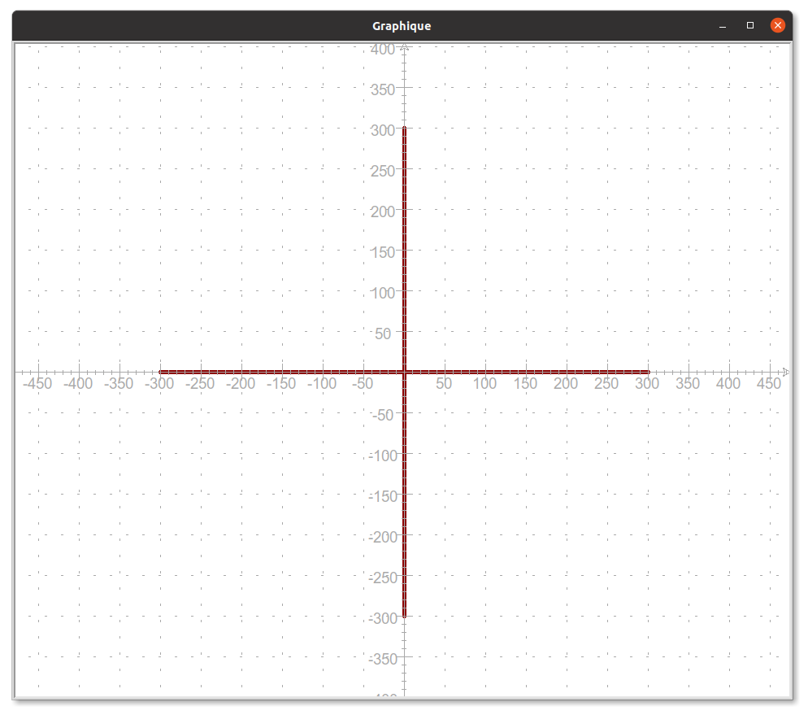
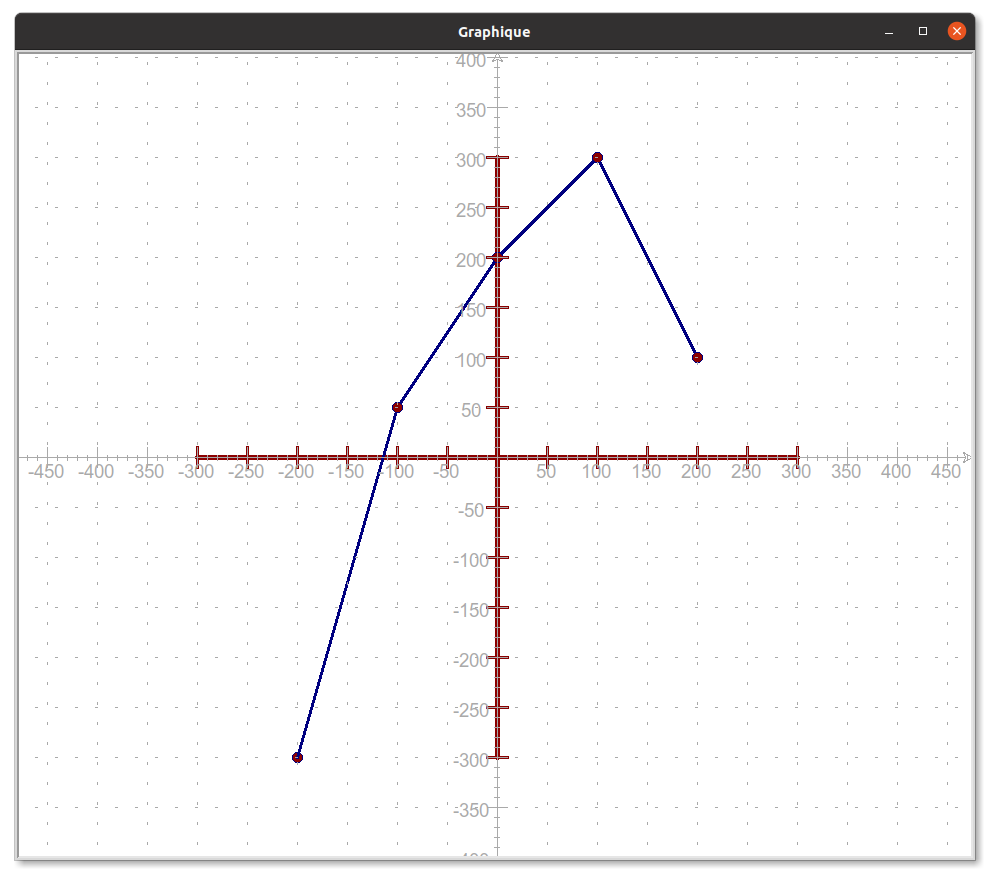
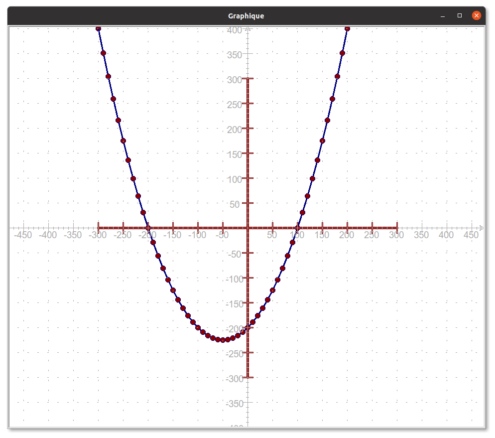

# Evaluation de NSI du 02/12/2021 (ou 03/12/2021)


## Première partie 

La première partie de l'évaluation est un {{sc("qcm")}} à réaliser dans Pronote. La durée maximum du {{sc("qcm")}} est de 30 min, dès que vous avez terminé, vous pouvez commencer la deuxième partie.

## Deuxième partie

!!! Attention
    Enregistrer votre programme dans le dossier `Evaluations` de votre répertoire personnel dans le dossier DS3

Le but de l'exercice est de dessiner à l'aide du module `turtle` un repère orthonormé (comme en mathématiques) puis de placer en les reliant une liste de points dans ce repère. On donne ci-dessous le début d'un programme Python permettant de créer les outils nécessaires au dessin :

```python
import turtle
papier = turtle.Screen()
crayon = turtle.Turtle()

### Ecrire vos instructions à la suite pour compléter le programme


### Pour éviter que la fenêtre de dessin ne se referme
papier.exitonclick()
```

### 1. Dessiner le repère
 
Dessiner les axes du repère avec un crayon de couleur `darkred` et une épaisseur de 5 comme ci-dessous (les graduations sont là pour vous aider et ne doivent pas être reproduites)
{: .centre}

### 2. Placer les points

 Dans ce repère on veut placer une liste de points en les reliant. On donne ci-dessous la liste des abscisses de ces points ainsi que la liste des ordonnées :
```
abscisses = [-200,-100,0,100,200]
ordonnees = [-300,50,200,300,100]
```
Par exemples, le premier point à placer a donc pour coordonnées `(-200;-300)` et le second point `(-100;50)`.
En utilisant **un parcours de liste**, placer ces points dans le repère en les reliant (crayon de couleur `navy` et d'épaisseur 3), vous devriez obtenir l'image suivante :

{: .centre}

### 3. Graduer les axes
On souhaite maintenant tracer les graduations sur chacun des deux axes, en utilisant **une ou plusieurs boucles** `for`, tracer les graduations sur chacun des deux axes tous les 50 pixels (on tracera des graduations de 20 pixels de longueur, crayon de couleur `darkred` et d'épaisseur 3). Vous devriez obtenir l'image suivante :
{: .centre}

### 4. Voir les points
Afin de marquer l'emplacement des points, on décide d'utiliser la fonction `stamp` de turtle qui dessine la forme de la tortue à l'emplacement où elle se trouve. Pour cela, on choisit une forme ronde pour la tortue à l'aide de `turtle.shape("circle")`, on diminue sa taille à l'aide de `crayon.shapesize(0.5)` et à chaque fois qu'on place un point on ajoute l'instruction `crayon.stamp()`. Modifier votre programme en conséquence, vous devriez obtenir le dessin suivant :
{: .centre}

### 5. Bonus : pour aller plus loin
On veut tracer dans notre repère la fonction suivante :   
$f : x \mapsto \dfrac{x^2}{100}+x-200$

1. Créer par compréhension la liste d'abscisses suivante :  
 `[-300,-290,-280,-270,-260,.....,300]`  
c'est à dire les entiers de `-300` à `300` de avançant de 10 en 10.
2. Créer par compréhension la liste d'ordonnées suivante : `[f(-300),f(-290),f(-280),......,f(300)]` c'est à dire la liste des images par la fonction $f$ des abscisses.
3. Tracer la fonction, vous devriez obtenir l'image suivante :
{: .centre}

### 6. Projet : pour aller encore plus loin ...
Créer un programme Python permettant de simuler le tracé de fonctions à la façon d'une calculatrice graphique. Les mêmes fonctionnalités qu'une calculatrice graphique sont attendues : possibilité de définir les axes du repère, de faire des lecture graphique, de tracer plusieurs fonctions, ...


