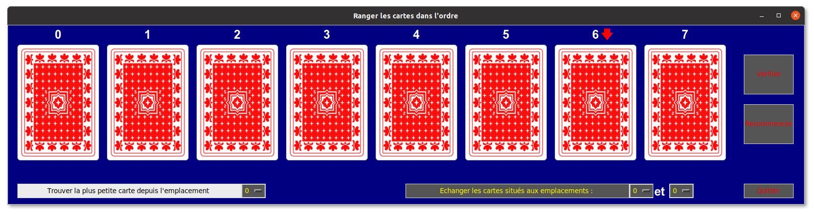





{{ titre_chapitre(num,titre,theme)}}
 
## Activités 

{{ titre_activite("Tri par sélection",[],0) }}

0. Commencer par télécharger une application Python :

    * {{telecharger("Tri par sélection","./files/C9/activite1.zip")}}
    * Copier ce fichier dans le répertoire de votre choix
    * Faire un clic droit sur le fichier compressé et choisir *Extraire ici*
    * Lancer le programme Python `activite1.py`, en tapant `python activite1.py` dans un terminal ou depuis Vs Code (en ayant ouvert le dossier contenant le fichier activite1.py)

1. Dans cette activité, on doit ranger des cartes par ordre croissant mais **sans les voir**, on dispose par contre de deux boutons :

    * Un bouton Trouver la plus petit carte depuis l'emplacement qui permet de savoir quelle carte est la plus petite à partir de l'emplacement qu'on sélectionne dans le menu déroulant à côté.
    * Un bouton Echanger les cartes situés aux emplacements qui permet d'échanger les cartes situés aux emplacements sélectionnés dans les menus déroulants.

    Voici une capture d'écran de l'application dans laquelle on vient de sélectionner la plus petite carte depuis l'emplacement 0, elle est alors indiquée par une flèche rouge au-dessus (emplacement 6) :
    {: .centre}

2. Proposer un algorithme permettant à un ordinateur de ranger une suite de nombres par ordre croissant.

3. Proposer une implémentation de cet algorithme en Python.

{{ titre_activite("Tri par insertion",[]) }}

## Cours

{{ aff_cours(num) }}

## QCM

{{qcm_chapitre(num)}}

## Exercices

{{ exo("TITRE EXO 1",[],0) }}

