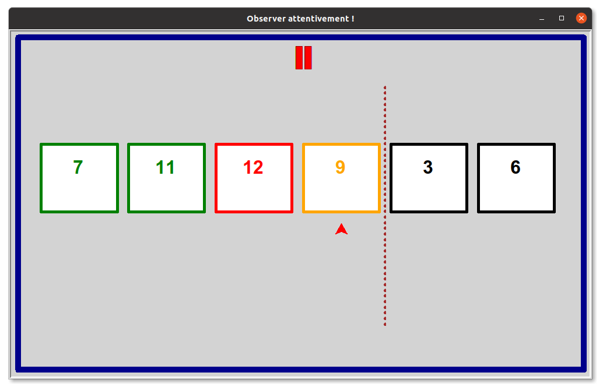





{{ titre_chapitre(num,titre,theme)}}
 
## Activités 

{{ titre_activite("Tri par sélection",[],0) }}

0. Commencer par télécharger une application Python :

    * {{telecharger("Tri par sélection","./files/C9/activite1.zip")}}
    * Copier ce fichier dans le répertoire de votre choix
    * Faire un clic droit sur le fichier compressé et choisir *Extraire ici*
    * Lancer le programme Python `activite1.py`, en tapant `python activite1.py` dans un terminal ou depuis Vs Code (en ayant ouvert le dossier contenant le fichier activite1.py)

1. Dans cette activité, on doit ranger des cartes par ordre croissant mais **sans les voir**, on dispose par contre de deux boutons :

    * Un bouton <span class=encadre>Trouver la plus petit carte depuis l'emplacement</span> qui permet de savoir quelle carte est la plus petite à partir de l'emplacement qu'on sélectionne dans le menu déroulant à côté.
    * Un bouton <span class=encadre>Echanger les cartes situés aux emplacements</span> qui permet d'échanger les cartes situés aux emplacements sélectionnés dans les menus déroulants.


    Voici une capture d'écran de l'application dans laquelle on vient de sélectionner la plus petite carte depuis l'emplacement 0, elle est alors indiquée par une flèche rouge au-dessus (emplacement 6) :
    {: .centre}

2. Proposer un algorithme permettant à un ordinateur de ranger une suite de nombres par ordre croissant.

3. Implémentation en python

    1. Ecrire une fonction `echange(liste,i,j)` qui échange les éléments d'indice `i` et `j` de la liste `liste` par exemple si `liste=[12,17,10,11,32]` alors après `echange(liste,0,2)` le contenu de `liste` sera `[10,17,12,11,32]`.
    2. Ecrire une fonction `min_depuis(liste,i)` qui renvoie le minimum de la liste `liste` à partir de l'indice `i` par exemple `min_depuis([10,17,12,11,32],2)` renvoie `11`.
    3. En utilisant ces deux fonctions, proposer une implémentation en Python de l'algorithme du tri par sélection.

{{ titre_activite("Tri par insertion",[]) }}

1. Le programme Python à télécharger ci-dessous vous permet de visualiser le rangement de 6 nombres compris entre 0 et 20 (tirés au hasard à chaque exécution) en utilisant l'algorithme du *tri par insertion*
{{telecharger("Tri par insertion","./files/C9/insertion.py")}}
Exécuter ce programme en visualisant attentivement le fonctionnement de l'algorithme (capture d'écran ci-dessous). Vous pouvez à tout instant mettre en pause le programme en cliquant dans la fenêtre.
{: .imgcentre}
2. Expliquer en quelques phrases le fonctionnement de cet algorithme, en particulier :
    * Que dire de la partie de la liste située avant le trait en pointillés ?
    * Que signifie le clignotement de deux cartes situées côte à côte ?
    * Comment procède-t-on pour insérer un élément à sa position dans la liste située avant le trait en pointillés ?
3. Faire fonctionner cet algorithme "à la main" sur la liste `[11,17,4,10,13,5]` en indiquant à chaque étape le contenu de la liste
4. Recopier et compléter l'implémentation en Python de cet algorithme (où on utilise la fonction `echange` définie dans l'activité précédente).
```python
def tri_insertion(liste):
    for index in range(...):
        k =  index - 1
        # Echanger l'élément avec celui qui le précède dans qu'il lui est supérieur (et que le début de liste n'est pas atteint)
        while liste[...]>liste[...] and k>=...:
            echange(liste,...,...)
            k = k -1
```
5. Tester cette fonction

## Cours

{{ aff_cours(num) }}


## QCM

{{qcm_chapitre(num)}}


## Exercices

{{ exo("Fonctionnement du tri par sélection",[],0) }}

1. Ecrire les étapes du tri par sélection pour la liste `[12,19,10,13,11,15,9,14]`
2. Même question pour la liste `["P","R","O","G","R","A","M","M","E"]

{{ exo("Fonctionnement du tri par insertion",[]) }}

1. Ecrire les étapes du tri par insertion pour la liste `[12,19,10,13,11,15,9,14]`
2. Même question pour la liste `["P","R","O","G","R","A","M","M","E"]


{{ exo("Comparaison de temps d'exécution",[])}}

1. Ecrire une fonction `hasard(n,mini,maxi)` qui renvoie une liste de `n` nombres entiers tirés au sort entre `mini` et `maxi`.
    
    !!! aide
        Utiliser la fonction `randint` du module random
    
2. En utilisant le module `time` de Python, donner une estimation du temps d'exécution de l'algorithme du tri par sélection vu en cours lorsque la taille de la liste augmente. On pourra utiliser un tableau comme :

    |Taille de la liste | Temps d'exécution|
    |-------------------|------------------|
    | $20\,000$ | ...... |
    | $40\,000$ | ...... |
    | $100\,000$ | ...... |
    | .... | ...... |

3. La méthode `sort` des listes de Python permet de trier une liste de Python, par exemple si `liste=[5,19,11,13]`, après l'exécution de `liste.sort()`, le contenu de liste devient : `liste = [5,11,13,19]`. Faire un tableau de mesures de temps d'exécution de `sort` en faisant varier la longueur de la liste comme ci-dessus.

4. En utilisant un tableur, tracer les graphiques des mesures de temps d'exécution pour l'algorithme du tri par sélection et pour la méthode `sort`. Que remarquez-vous ?

{{ exo("Tri à bulles",[])}}

1. En effectuant vos propres recherches sur le *web*, expliquer le principe du **tri à bulles**.
2. Détailler le fonctionnement de cet algorithme de tri sur la liste suivante : `[12,9,17,11,3]`
3. Programmer cet algorithme en python

    !!! aide
        On pourra utiliser la fonction `echange(liste,i,j)` déjà programmée en cours. 

{{ exo("Liste triée",[])}}

1. Ecrire une fonction `est_triee(liste)` qui renvoie `True` si `liste` est triée par ordre croissant et `False` dans le cas contraire.

    !!! Attention
        On ne doit pas trier la liste, simplement vérifier si elle l'est déjà ou pas.