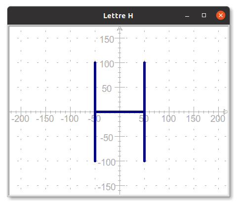
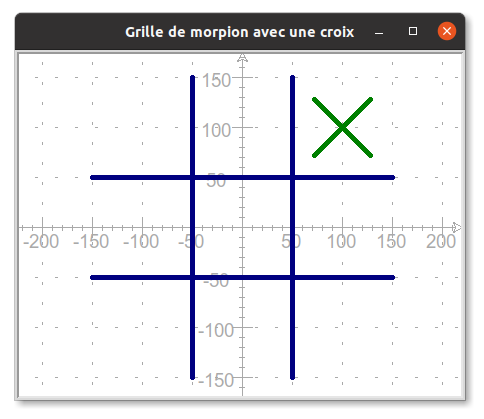






{{ titre_chapitre(num,titre,theme)}}
 
## Activités 

{{ titre_activite("Desssiner avec le module turtle",["notebook"],0) }}


{{ telecharger("Jupyter Notebook","./notebook/pendu1.ipynb")}}


{{ titre_activite("Premières fonctions",["notebook"]) }}


{{ telecharger("Jupyter Notebook","./notebook/pendu2.ipynb")}}


## Cours

{{ aff_cours(num) }}


## QCM

{{qcm_chapitre(num)}}

## Exercices

{{ exo("Quelques dessins avec turtle",[],0) }}
Ecrire un programme Python permettant de dessiner les figures suivante :
!!! Aide
    On donne le squelette de programme suivant qui servira de point de départ :
    ```python3
        import turtle
        papier = turtle.Screen()
        crayon = turtle.Turtle()
        crayon.pensize(5)
        crayon.color("navy")
    ```

1. La lettre H <br>
{: .imgcentre}

2. Une croix centrée sur l'origine <br>

    !!! Attention
        * La longueur totale d'une branche de couleur est de 200 pixels
        * Les couleurs des branches sont *navy* et *darkred*
        * La branche de couleur *navy* fait un angle de 45° avec l'horizontale
    {: .imgcentre}

3. Des cercles <br>
{: .imgcentre}

{{ exo("Utilisation d'une fonction",[])}}

!!! Rappel
    On donne ci-dessous le code de la fonction `ligne(x1,y1,x2,y2)` vue dans l'activité 2, elle permet de tracer la ligne joignant les points d'extrémités `(x1,y1)` et `(x2,y2)`
    ```python3
        def ligne(x1,y1,x2,y2):
            crayon.penup()
            crayon.goto(x1,y1)
            crayon.pendown()
            crayon.goto(x2,y2)
    ```

1. En utilisant la fonction `ligne`, construire la grille de morpion suivante :
{: .imgcentre}
2. Dessiner de nouveau la [lettre H de l'exercice 1](#exercice-1-quelques-dessins-avec-turtle) en vous aidant de cette fonction. 
3. Comparer les deux programmes (avec et sans fonction), qu'en pensez-vous ?

{{ exo("Ecrire une fonction",[])}}

Le but de l'exercice est de pouvoir dessiner une croix dans l'une quelconque des cases de la grille de morpion de l'exercice précédent. Comme par exemple dans la case supérieure droite tel qu'illustré ci-dessous.
{: .imgcentre}
Les croix ont toujours la même couleur (*green*) et la même taille (des branches de longueur 40 pixels), seule la position de leur centre varie. On décide donc, d'écrire une fonction `croix(x,y)` qui trace la croix à partir du point de coordonnées `(x,y)`

1. Recopier et compléter l'écriture de la fonction croix (pour l'instant seule la branche supérieure droite est tracée):
```python3
    def croix(x,y):
        crayon.penup()
        crayon.goto(x,y)
        crayon.pendown()
        crayon.setheading(45)
        crayon.forward(40)
        ...
```
2. Utilisation de la fonction
    1. Quel appel à la fonction `croix` permet de tracer la croix se situant dans la case supérieure droite ?
    2. Quel sera le résultat de l'instruction `croix(-100,0)` ?

{{ exo("Une fonction cercle",[])}}

1. En vous inspirant de l'exercice 3, écrire une fonction `cercle(x,y)` qui permet de tracer un cercle de rayon 35 et de couleur *darkred* dans l'une quelconque des cases de la grille de morpion. Comme par exemple ci-dessous dans la case inférieure droite.
{: .imgcentre}
2. Reproduire la grille de morpion suivante en utilisant les fonctions `croix` et `cercle` :
{: .imgcentre}

