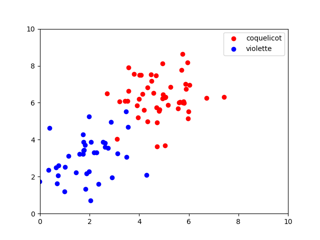
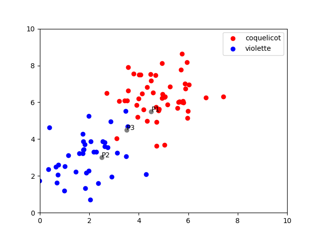
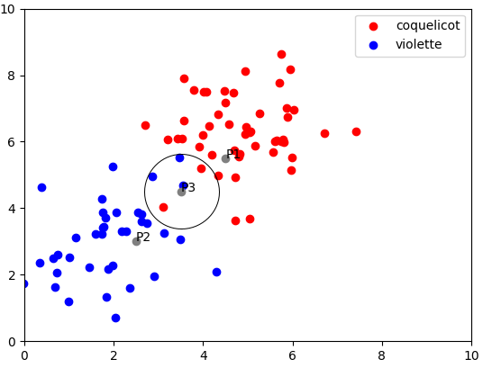
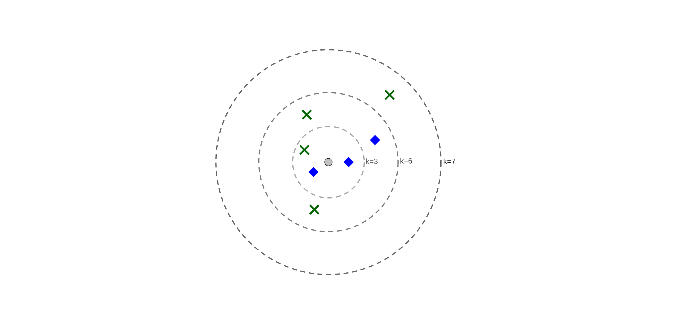





{{ titre_chapitre(num,titre,theme)}}
 
## Activités 
 
{{ titre_activite("Classification",[],0)}}

1. Dans un champ, à l'état sauvage deux types de fleurs ont poussés : des coquelicots et des violettes. On a représenté ci-dessous par un schéma la position de ces fleurs dans le champ.

    * les points rouges représentent des coquelicots
    * les points bleus résentent des violettes 

    {: .imgcentre}
    Comme vous pouvez le constater, en dépit de certaines variations, les violettes semblent plus pousser dans la partie inférieure gauche du champ tandis que les coquelicots poussent plutôt vers la partie centrale du champ. 

    Trois nouvelles pousses apparaissent dans ce champ, on les a représenté par des points de couleurs grises et on les identifie avec les noms `P1, P2` et `P3` comme représenté ci-dessous :
    {: .imgcentre}
    On cherche à prédire si ces pousses sont des coquelicots ou des violettes.

    1. Que peut-on dire pour la pousse `P1` ?
    2. Même question pour la pousse `P2`.
    3. Que dire du cas de `P3` ? Peut-on répondre avec le même niveau de confiance que pour `P1` et `P2` ?
    4. Ci-dessous on a tracé un cercle de façon à faire apparaître les 5 voisins les plus proches de la pousse P3. Prédire le cas de `P3` en choisissant l'espèce majoritaire de ce cercle.
    {: .imgcentre}
    5. A la question précédente, on a prédit le cas de `P3` avec l'**algorithme des k plus proches voisins**. Quel est le principe de cet algorithme ? Avec quelle valeur de **k** a-t-il été utilisé ?

2. On considère le nouvel exemple suivant dans lequel la donnée à classer est représentée par le point gris central:

    1. Quel est le résultat de l'algorithme des k plus proches voisins lorsque k=3 ?
    2. Même question lorsque k=6.
    3. Même question lorsque k=7.
    4. Que peut-on dire pour le résultat prédit par l'algorithme suivant les valeurs de k ?
    5. Quelles valeurs de k permettent d'éviter les cas d'égalités ?

{{ titre_activite("Mise en oeuvre en Python",["notebook"]) }}
{{ telecharger("Jupyter Notebook","notebook/PlusProchesVoisins.ipynb")}}

## Cours

{{ aff_cours(num) }}

## QCM

{{qcm_chapitre(num)}} 

## Exercices
