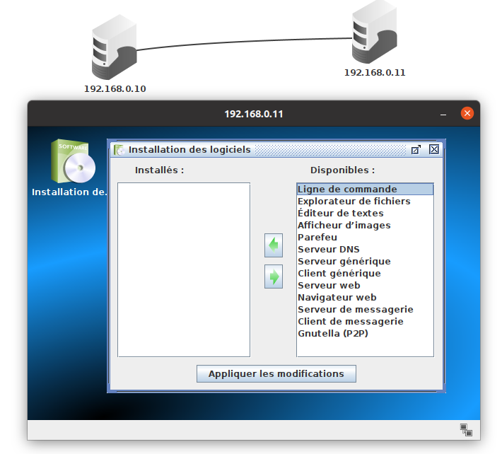
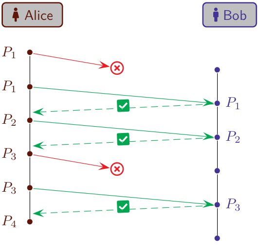
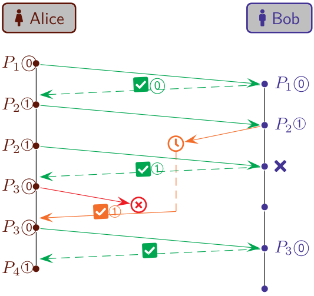





{{ titre_chapitre(num,titre,theme)}}
 
## Activités 

{{ titre_activite("Simuler un réseau avec Filius",[],0) }}

Lancer [Filius](https://www.lernsoftware-filius.de/), un outil de simulation de réseaux, repérer les deux modes d'utilisation dans la barre supérieure :

{align=left} 

* En mode conception (icone marteau) on crée un réseau
* En mode simulation (icone triangle vert) on fait fonctionner le réseau

 

1. Dans la barre latérale se trouvent les éléments constitutifs d'un réseau, placer un ordinateur, faire un clic droit pour afficher sa configuration, et cocher la case "Utiliser l'adresse {{ sc("ip")}} comme nom".
Vous devriez voir apparaître les éléments suivants :

2. Adresse MAC
    1. Dans Filius, l'adresse MAC est-elle modifiable ? Quel est son format ?
    2. Rechercher la signification de cette adresse sur le *Web*.
    3. Quel élément d'un ordinateur est identifié de façon unique par son adresse MAC ?

3. Adresse IP
    1. L'adresse IP est-elle modifiable ?
    2. Filius affichera en rouge une adresse IP non valide, en testant différentes valeurs conjecturer le format d'une adresse IP valide.
    3. Sur combien d'octets peut-on coder une adresse IP ?

    !!! Attention
        La notion de **masque de sous réseau** ne sera pas étudiée (mais un exercice y est consacré), retenir simplement que le masque 255.255.255.0 signifie que des ordinateurs dont les adresses IP commencent par les 3 mêmes numéros peuvent communiquer.

4. Placer un second ordinateur et les relier par un cable, attribuer deux adresses IP commençant par les mêmes trois valeurs aux deux ordinateurs (voir remarque ci-dessus). Passer en mode simulation.
    1. Cliquer sur l'un des ordinateurs, une interace permettant d'installer des logiciels sur cet ordinateur apparait, sélection la ligne de commande et l'installer :
    {width=500px}
    2. Tester la commande `ifconfig`, quel est son rôle ?
    3. Tester la commande `ping` en donnant l'adresse IP de l'autre ordinateur, quel est le rôle de cette commande ?

5. Peut-on ajouter un troisième ordinateur et les relier aux  autres avec un cable ? Pourquoi ?

6. Utiliser un switch pour relier entre eux trois ordinateurs. Tester de nouveau la commande ping pour vérifier qu'ils peuvent communiquer.

{{ titre_activite("Découpage en paquets",[]) }}
Quatre ordinateurs A,B,C et D sont reliés en réseau par un routeur. Des données (en rouge) sont émises **en un seul envoi continu** de A vers B comme illustré ci-dessous :
{: .imgcentre width=500px}

1. Que faut-il faire si le routeur tombe en panne momentanément pendant le passage des données ?
2. Que se passe-t-il si l'ordinateur C envoie en même temps des données vers D ?

    Le schéma suivant illustre un envoi des données **par paquets** (P1, P2, P3, P4 et P5):
    {: .imgcentre width=500px}

3. Une panne momentanée du routeur est moins problématique, pourquoi ?
4. L'ordinateur C peut-il envoyer des données en même temps vers D ? 

{{ titre_activite("Protocole du bit alterné",[]) }}
Alice envoie un message découpé en cinq paquets $P_1,P_2,P_3,P_4$ et $P_5$ à Bob :
{: .imgcentre width=400px}
Certains paquets peuvent être en retard ou perdus, dans l'exemple suivant, $P_1$ est en retard, $P_2$ et $P_4$ sont perdus. 
{: .imgcentre width=400px}

1. Quel sera alors, le message reçu par Bob ?

    Afin de palier à ces erreurs de transmission, Bob propose à Alice la solution suivante : *"Je t'enverrai une confirmation de reception pour chaque paquet, tant que tu ne l'as pas reçu, renvoie le même paquet"*
    {: .imgcentre width=400px}
    La schéma ci-dessous montre que ce nouveau protocole permet de palier à certains problèmes. Les paquets perdus $P_1$ et $P_3$ ont étés émis de nouveau en l'absence d'accusé de réception.

2. Compléter le schéma suivant de communication avec ce nouveau protocole :
    {: .imgcentre width=400px}
3. Quel est le message reçu par Bob ? Quelles erreurs se produisent ?

    Alice propose d'améliorer le protocole de Bob de la façon suivante : *"Lorsque j'envoie un paquet je vais y joindre un 0 ou un 1, j'attendrai de recevoir un accusé de réception accompagné du même chiffre pour envoyer le paquet suivant. De ton côté, tu ne dois pas prendre en compte deux paquets consécutifs portant le même numéro ! *"

    Ce nouveau fonctionnement est illustré par le schéma suivant :
    {: .imgcentre width=400px}

4. Expliquer pourquoi Bob a ignoré le second envoi du paquet $P_2$ avec le bit 1.

5. Bien qu'elle est reçu un accusé de réception entre temps, Alice envoie deux fois de suite le paquet $P_3$ avec le bit 0. Pourquoi ?

6. Reprendre le schéma précédent en supposant que l'envoi de $P_4$ échoue et que l'accusé de réception de $P_2$ arrive encore plus en retard, c'est à dire après l'envoi de $P_4$ avec le bit 1. Que se passe-t-il alors ?

7. Que peut-on en conclure pour ce nouveau protocole ?

## Cours

{{ aff_cours(num) }}

## QCM

{{qcm_chapitre(num)}}

## Exercices

{{ exo("Adresse IP",[],0)}}

1. Rappeler le format d'une adresse {{sc("ip")}}v4 valide.
2. Les adresses {{sc("ip")}} suivantes sont-elles valides ?
    * 192.32.257.110
    * 129.21.10.
    * 212.225.0.132
    * 44.125.80.33.112
3. Ecrire une fonction Python `valide_ip(adresse)` qui  renvoie `True` si `adresse` est une adresse {{sc("ip")}} valide et `False` sinon.
4. Calculer le nombre total d'adresses {{sc("ip")}}v4 possibles.

    !!! aide
        On pourra utiliser la méthode `split` des chaines de caractères en Python.
        
4. Tester votre fonction sur les exemples de la question 2.

{{ exo("Ligne de commande",[])}}

1. La commande `ifconfig` permet d'afficher l'état des interfaces réseau actives. Tester cette commande et en déduire l'adresse IP de votre machine ainsi que son adresse {{sc("mac")}}.
2. La commande `traceroute` affiche la liste des adresses IP traversées par les paquets jusqu'à la destination donnée en paramètre. Tester par exemple `traceroute wikipedia`. Quel est la première adresse {{sc("ip")}} traversé par un paquet lorsque vous lancez cette commande depuis le lycée ? Pourquoi ?
3. Faire vos propres recherche sur la commande `ping`, quel est son utilité ?

    !!! Lien "Pour aller plus loin"
        Pour aller plus loin, rechercher la signification du champ `ttl` d'une commande ping. Que deviennent les paquets qui ne trouvent pas leur destination ?

{{ exo("Masque de sous réseau",[]) }}

!!! Attention
    Cette notion n'ayant pas été traitée en cours, avant de faire l'exercice on pourra lire le résumé ci-dessous ou faire ses propres recherches sur le *Web* (en commençant par exemple [sur wikipedia](https://fr.wikipedia.org/wiki/Sous-r%C3%A9seau){target=_blanl}).

Deux machines ne peuvent communiquer que si elles sont sur le même réseau, c'est à dire que leurs adresses {{sc("ip")}} démarre par une partie commune. La longueur de cette partie commune est définie par le **masque de sous réseau**. Pour la connaître, on écrit le masque de sous réseau en binaire. Le nombre de 1 en début de masque donne la longueur de la partie commune dans les adresses IP. Par exemple  le masque `255.255.254.0` donne en écriture binaire `11111111.11111111.111111110.00000000`. La partie commune doit donc être de 23 bits car cette écriture débute par 23 fois le chiffre `1`. Un masque de 23 bits peut se noter de façon plus concise `/23` (notation {{sc("cidr")}}). Pour savoir si deux machines de ce réseau peuvent communiquer on écrit leurs adresses IP en binaire et on regarde si les 23 premiers bits sont identiques ou non.

1. Donner la notation {{sc("cidr")}} du masque `255.255.240.0`
2. On considère trois machines A (`192.168.130.10`), B (`192.168.155.100`) et C (`192.168.144.203`) :
    1. Quelles machines peuvent communiquer entre elles ?
    2. Créer ce réseau dans filius
    3. Confirmer à l'aide de `ping` vos réponses à la question 2.a
3. Dans un sous réseau, deux adresses sont réservées, l'une pour le *broadcast* (envoi à tout le réseau) et l'autre pour le réseau lui-même. Par exemple pour le masque `255.255.254.0`, on peut avoir au maximum $2^9-2=510$ ordinateurs dans le sous réseau. Sur le sous réseau domestique d'une livebox, le masque de sous réseau est généralement `255.255.255.0`. Combien d'ordinateurs peuvent être connectés dans ce cas ?
4. Déterminer le masque de sous réseau du réseau du lycée à l'aide de la commande `ifconfig`, combien d'ordinateurs peuvent être connectés sur ce réseau ?
5. Donner le plus petit masque pour lequel le sous réseau pourra accueillir 1500 machines.

{{ exo("Protocole du bit alterné",[])}}

1. Le protocole du bit alterné permet-il de corriger la *totalité* des erreurs pouvant survenir ?
2. Fonctionnement du protocole du bit alterné :
    1. L'émetteur a envoyé un paquet $P_5$ avec le bit de contrôle à 1, il reçoit un accusé de reception avec le bit de contrôle à 0. Quelle sera la réaction de l'émetteur ?
    2. Le récepteur a envoyé un accusé de reception avec le bit de contrôle à 0. Il reçoit un paquet avec le bit de contrôle à 0. Quelle sera la réaction du récepteur ?
    3. Le récepteur a envoyé un accusé de reception avec le bit de contrôle à 0. Il reçoit un paquet avec le bit de contrôle à 1. Quelle sera la réaction du récepteur ?
3. Proposer un scénario dans lequel le protocole du bit alterné échoue à corriger une erreur de transmission.
