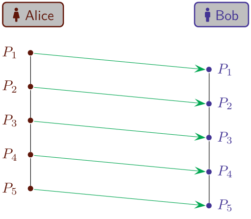





{{ titre_chapitre(num,titre,theme)}}
 
## Activités 

{{ titre_activite("Simuler un réseau avec Filius",[],0) }}

Lancer [Filius](https://www.lernsoftware-filius.de/), un outil de simulation de réseaux, repérer les deux modes d'utilisation dans la barre supérieure :

{align=left} 

* En mode conception (icone marteau) on crée un réseau
* En mode simulation (icone triangle vert) on fait fonctionner le réseau

 

1. Dans la barre latérale se trouvent les éléments constitutifs d'un réseau, placer un ordinateur, faire un clic droit pour afficher sa configuration, et cocher la case "Utiliser l'adresse {{ sc("ip")}} comme nom".
Vous devriez voir apparaître les éléments suivants :

2. Adresse MAC
    1. Dans Filius, l'adresse MAC est-elle modifiable ? Quel est son format ?
    2. Rechercher la signification de cette adresse sur le *Web*.
    3. Quel élément d'un ordinateur est identifié de façon unique par son adresse MAC ?

3. Adresse IP
    1. L'adresse IP est-elle modifiable ?
    2. Filius affichera en rouge une adresse IP non valide, en testant différentes valeurs conjecturer le format d'une adresse IP valide.
    3. Sur combien d'octets peut-on coder une adresse IP ?

    !!! Attention
        La notion de **masque de sous réseau** ne sera pas étudiée (mais un exercice y est consacré), retenir simplement que le masque 255.255.255.0 signifie que des ordinateurs dont les adresses IP commencent par les 3 mêmes numéros peuvent communiquer.

4. Placer un second ordinateur et les relier par un cable, attribuer deux adresses IP commençant par les mêmes trois valeurs aux deux ordinateurs (voir remarque ci-dessus). Passer en mode simulation.
    1. Cliquer sur l'un des ordinateurs, une interace permettant d'installer des logiciels sur cet ordinateur apparait, sélection la ligne de commande et l'installer :
    {width=500px}
    2. Tester la commande `ifconfig`, quel est son rôle ?
    3. Tester la commande `ping` en donnant l'adresse IP de l'autre ordinateur, quel est le rôle de cette commande ?

5. Peut-on ajouter un troisième ordinateur et les relier aux  autres avec un cable ? Pourquoi ?

6. Utiliser un switch pour relier entre eux trois ordinateurs. Tester de nouveau la commande ping pour vérifier qu'ils peuvent communiquer.

{{ titre_activite("Découpage en paquets",[]) }}

{{ titre_activite("Couches d'un réseau",[]) }}

{{ titre_activite("Protocole du bit alterné",[]) }}
Alice envoie un message découpé en cinq paquets $P_1,P_2,P_3,P_4$ et $P_5$ à Bob :
{: .imgcentre width=400px}
Certains paquets peuvent être en retard ou perdus, dans l'exemple suivant, $P_1$ est en retard, $P_2$ et $P_4$ sont perdus. 
{: .imgcentre width=400px}

1. Quel sera alors, le message reçu par Bob ?

    Afin de palier à ces erreurs de transmission, Bob propose à Alice la solution suivante : *"Je t'enverrai une confirmation de reception pour chaque paquet, tant que tu ne l'as pas reçu, renvoie le même paquet"*
    {: .imgcentre width=400px}
    La schéma ci-dessous montre que ce nouveau protocole permet de palier à certains problèmes. Les paquets perdus $P_1$ et $P_3$ ont étés émis de nouveau en l'absence d'accusé de réception.

2. Compléter le schéma suivant de communication avec ce nouveau protocole :
    {: .imgcentre width=400px}
3. Quel est le message reçu par Bob ? Quelles erreurs se produisent ?

    Alice propose d'améliorer le protocole de Bob de la façon suivante : *"Lorsque j'envoie un paquet je vais y joindre un 0 ou un 1, j'attendrai de recevoir un accusé de réception accompagné du même chiffre pour envoyer le paquet suivant. De ton côté, tu ne dois pas prendre en compte deux paquets consécutifs portant le même numéro ! *"

    Ce nouveau fonctionnement est illustré par le schéma suivant :
    {: .imgcentre width=400px}

4. Expliquer pourquoi Bob a ignoré le second envoi du paquet $P_2$ avec le bit 1.

5. Bien qu'elle est reçu un accusé de réception entre temps, Alice envoie deux fois de suite le paquet $P_3$ avec le bit 0. Pourquoi ?

6. Reprendre le schéma précédent en supposant que l'envoi de $P_4$ échoue et que l'accusé de réception de $P_2$ arrive encore plus en retard, c'est à dire après l'envoi de $P_4$ avec le bit 1. Que se passe-t-il alors ?

7. Que peut-on en conclure pour ce nouveau protocole ?

## Cours

{{ cours("CHEMIN VERS PDF DE COURS") }}

## QCM

{{qcm_chapitre(num)}}

## Exercices

{{ exo("Masque de sous réseau",[],0) }}

